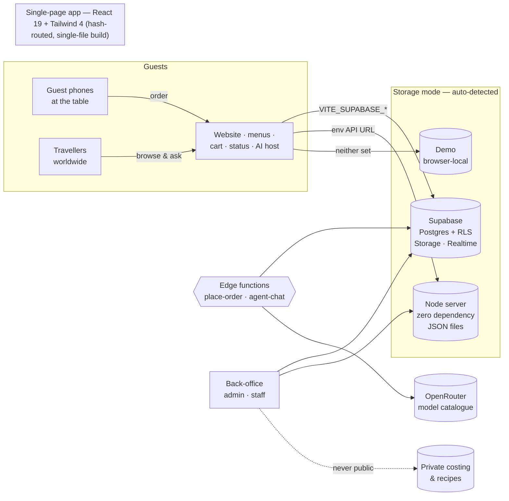
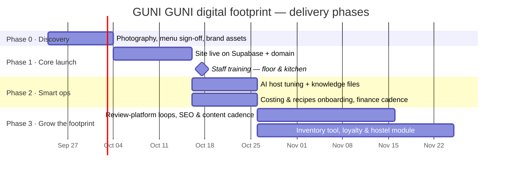
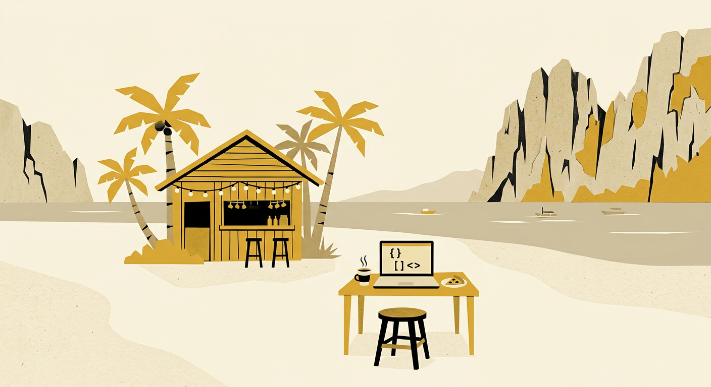

<div align="center">


# The GUNI GUNI Digital Footprint

### A working proposal by [merqato.digital](https://merqato.digital/) — Palawan Island → the world

**For:** GUNI GUNI Hostel & Bistro · 263 Manalo Extension, Brgy. Milagrosa, Puerto Princesa City, Palawan
**Prepared:** September 2026 · **Status:** Working build — scope open for discovery & confirmation

</div>

---

> [!IMPORTANT]
> **This repository *is* the proposal.** Not a PDF mock, not a slide deck — a running platform you can
> read, run, review and evolve. Every page below is editable like a document and versioned like software.
> This is how we think a digital footprint should be presented in 2026: **as the thing itself.**
>
> 📖 [Full proposal →](docs/PROPOSAL.md)  ·  🗺 [Why GitHub is the proposal →](docs/GITHUB-AS-PROPOSAL.md)  ·  🛠 [Technical reference →](docs/DEVELOPMENT.md)

---

## Contents

1. [The opportunity](#1-the-opportunity)
2. [What we're proposing](#2-what-were-proposing)
3. [Walk the floors](#3-walk-the-floors)
4. [Tech stack](#4-tech-stack)
5. [Code tree](#5-code-tree)
6. [Architecture](#6-architecture)
7. [Data, security & trust](#7-data-security--trust)
8. [Three ways to run it](#8-three-ways-to-run-it)
9. [Roadmap](#9-roadmap)
10. [Why GitHub is the proposal](#10-why-github-is-the-proposal)
11. [About the studio](#11-about-the-studio)

---

## 1. The opportunity

GUNI GUNI already has what most hospitality brands spend years trying to buy: **a name people repeat.**
Travellers rate the bistro and hostel **8.8/10 across hundreds of Booking.com reviews** and **"Very good"
(4.6) on [Tripadvisor]** — and the reviews say the quiet part out loud: *"the restaurant was the biggest
surprise… the best food ever."*

Yet today, most of that reputation lives on review platforms someone else owns. The menu is a photo on
social media. Orders travel by memory and paper. Food cost, margins, 86'd items, happy-hour momentum —
invisible until the end of the month.

**A digital footprint changes that:** your own site, your own ordering flow, your own back-office, your
own AI host — one coherent system that turns word-of-mouth into owned, measurable, revisitable presence —
for guests already inside 263 Manalo Extension **and** for the travellers worldwide searching
*"where to eat in Puerto Princesa"* tonight.

> Built with affection for a real place: daily 7:00 AM–11:00 PM bistro, happy hour 4–7 PM, adults-only
> hostel upstairs, *"Same tables. New stories every. day."* — all of that is already encoded in the build.

## 2. What we're proposing

A single, integrated platform in three layers — already implemented as working code in this repo:

| Layer | What it is | Who it serves |
| --- | --- | --- |
| 🍝 **Guest experience** | Editorial-style website, full menu (75 dishes & drinks across pasta, pizza, burgers, sides, starters and the bar), **order-from-your-table** flow with live order-status page | Guests & followers worldwide |
| 🧑‍🍳 **Operations** | Protected **staff dashboard** (accept → prepare → ready → complete), the **86-list**, availability toggles, service-charge handling | Floor & kitchen |
| 🗄 **Back-office (CMS)** | Full admin: theme & fonts, header/footer, home page, sections, custom pages, menu editor, media library, **private costing & recipes** with margin analytics, **AI agent** console, one-click **Publish** | Owner & managers |

**Plus:** an **AI virtual host** guests can chat with ("Ask us" widget), and an **AI operations
assistant** for staff — morning/afternoon briefings, numbers checks and low-stock calls, grounded in your
own menu and your own numbers.

### What changes on day one

| Before | After |
| --- | --- |
| Menu as a social-media photo | Live menu, editable in the back-office, always accurate |
| Orders relayed verbally | Table → kitchen pipeline with statuses & idempotent, server-validated pricing |
| "I think that pasta is profitable" | Per-dish recipe cost, gross profit, food/bev cost %, thin-margin watchlist |
| Generic chatbot on someone else's app | **Your** AI host: your menu, your voice, your knowledge files, your API key — kept server-side |
| Presence scattered across platforms | One owned footprint to link from Instagram, TikTok, Google, Tripadvisor, Booking & Hostelworld |

## 3. Walk the floors

Routes are hash-based, so the static preview works anywhere — no server required to look around.

| Route | What you'll find |
| --- | --- |
| `/#/` | Home — yellow-panel editorial hero, marquee, "The Place", menu carousel |
| `/#/menu/pasta` | Homemade pasta (tagliatelle, ravioli), vegetarian marked 🌿 |
| `/#/menu/pizza` | 12″ hand-tossed pizza, burgers with fries, sides, starters |
| `/#/menu/drinks` | Cocktails, beers, mixed drinks — wine & spirits as **Glass / Bottle** |
| `/#/<slug>` | Custom pages (About, Blog, Location…) created in the admin, auto-added to nav |
| `/#/order/:id` | Customer order status — live as the kitchen moves it |
| `/#/staff` | Staff dashboard + availability board (PIN or Supabase sign-in) |
| `/#/admin` | The back-office. **Hidden entrance:** tap the round logo three times |

**Demo mode** (no backend at all): PIN `1234` opens staff & admin; everything stays in the browser.
**Bundled Node server defaults:** staff `1234`, admin `5309` — both overridden by env vars in production.

## 4. Tech stack

Chosen deliberately: **boring where it should be, sharp where it counts.** Everything here is a
mainstream, hireable, transferable technology — no lock-in to us or to anyone.

<div align="center">


</div>

| Layer | Technology | Why this choice |
| --- | --- | --- |
| UI | **React 19 + TypeScript** (strict) | Component system the whole industry understands; type-safe CMS shapes |
| Styling | **Tailwind CSS 4** via `@tailwindcss/vite` | Token-driven theme — the back-office recolors the whole site from 8 color tokens + 4 font roles, live |
| Build | **Vite 7** + `vite-plugin-singlefile` | One self-contained HTML artifact — trivially emailable, reviewable, hostable |
| Routing | **React Router 7** (hash mode) | Deep-links to menus work on any static host, no server rewrites |
| State | React context stores (`AppContext`, `SiteContext`) | Cart, session, draft-vs-published config — no framework needed beyond React |
| Backend A | **Supabase** — Postgres, **RLS**, Auth, Storage, **Edge Functions (Deno)**, Realtime | Managed, scalable, Philippine-latency-friendly; key stays in function secrets |
| Backend B | **Zero-dependency Node ≥18** server (`node:http`, `crypto`, JSON files) | Runs on the bistro's own PC or any plain VPS — no services, no monthly bill |
| Backend C | **Demo mode** — localStorage + IndexedDB (media) | The platform demos itself even offline |
| AI | **OpenRouter** catalogue (free ↔ frontier models), server-side key, knowledge-file grounding, test-before-trust "Working" light | Model choice is a settings page, not a rewrite |
| Money logic | Server-side price re-computation, idempotency keys, transition-state machine for orders | The browser can never decide a price or skip a status |

**~12,500 lines** of TypeScript/JavaScript/SQL — every line reviewable in this repo.

## 5. Code tree

```
guniguni/
├── index.html                       # Entry — brand fonts, meta, theme color
├── package.json                     # React 19 · Vite 7 · Tailwind 4 · Router 7 · Supabase JS
├── vite.config.ts                   # Vite + React + Tailwind + single-file build, @ alias
├── tsconfig.json                    # Strict TypeScript
├── README.md                        # ← you are here (the proposal)
├── docs/
│   ├── PROPOSAL.md                  # Scope, deliverables, phases, terms
│   ├── GITHUB-AS-PROPOSAL.md        # The strategy: GitHub as a proposal platform
│   ├── DEVELOPMENT.md               # Run, deploy & operate (engineering reference)
│   └── img/                         # Proposal artwork
├── src/
│   ├── App.tsx                      # Routes, chrome, cart shell, agent widget
│   ├── main.tsx                     # React bootstrap
│   ├── index.css                    # Tailwind theme tokens + editorial type system
│   ├── components/
│   │   ├── chrome.tsx               # Header, footer, review-platform blocks
│   │   ├── nav.tsx                  # Navigation
│   │   ├── sections.tsx             # 9 CMS section renderers (text, blog, gallery…)
│   │   ├── ordering.tsx             # Cart bar/drawer, item sheet, toasts
│   │   ├── AgentWidget.tsx          # Guest "Ask us" AI chat
│   │   ├── AgentOps.tsx             # Staff AI ops console (briefs, numbers, 86 board)
│   │   ├── ui.tsx / brandIcons.tsx  # UI kit, social & review platform icons
│   ├── context/
│   │   ├── AppContext.tsx           # Cart/session state
│   │   └── SiteContext.tsx          # Draft vs published site configuration
│   ├── data/
│   │   ├── menu.json / menu.ts      # 75 items · 11 sections · glass/bottle variants · 5% service charge
│   │   ├── site.ts                  # Site config types + defaults + deep-merge
│   │   ├── costing.ts               # Recipes, ingredient index, margins
│   │   ├── finance.ts               # Week/month/YTD reports, food/bev %, avg check
│   │   ├── agentSkills.ts           # AI skills & scheduled tasks + live ops snapshots
│   │   └── assets.ts                # 14 photography slots, build-time pickup
│   ├── lib/
│   │   ├── backend.ts               # Backend interface: orders, auth, media, costing
│   │   ├── supabaseBackend.ts       # Supabase adapter (auto-selected by env)
│   │   ├── openrouter.ts            # Model catalogue & chat client
│   │   ├── media.ts                 # Image downscale, transparency-safe
│   │   └── knowledgeTemplate.ts     # Agent knowledge-file scaffolding
│   ├── pages/
│   │   ├── Home.tsx                 # Hero · marquee · place · carousel · CTA
│   │   ├── PastaMenu / PizzaMenu / DrinksMenu.tsx
│   │   ├── OrderStatus.tsx          # Customer-facing live status
│   │   ├── Staff.tsx                # Order pipeline + 86-list
│   │   └── admin/
│   │       ├── Admin.tsx            # Back-office shell
│   │       ├── sectionsPanel.tsx    # Pages & sections builder
│   │       ├── costingPanel.tsx     # Private costs, recipes, exports
│   │       └── financeView.tsx      # Financials dashboard
│   └── assets/photos/               # Photography lands here (see slot README)
├── server/
│   └── index.mjs                    # Zero-dep Node API: orders, CMS, media, secrets, AI proxy
└── supabase/
    ├── migrations/                  # Schema, RLS, RPCs, private costing table
    └── functions/
        ├── place-order/             # Price validation + order insert (service role)
        └── agent-chat/              # OpenRouter proxy — key never reaches browsers
```

## 6. Architecture



Two details we are proud of — because they protect a real business, not a demo:

1. **Prices are always re-computed server-side** against the *published* menu; the browser's number is
   never trusted. Repeated taps are de-duplicated with an idempotency key.
2. **Costs & recipes live behind an admin-only wall** — a separate table / file, never shipped with the
   public site config, never seen by the AI guest host.

## 7. Data, security & trust

| Concern | How it's handled |
| --- | --- |
| Staff access | Email/password via Supabase Auth **or** PIN + timing-safe comparison on the Node server; 12 h tokens |
| Rate limiting | Login, ordering & AI endpoints throttled |
| Order integrity | Status transition rules enforced **in the database** (`submitted → accepted → preparing → ready → completed`) |
| AI key | OpenRouter key lives in Edge-Function secrets / `secrets.json` — never in the bundle |
| Row-level security | Guests read the published config & their own order *only*; staff-only writes; admin-only publishing |
| Privacy | Private margins & supplier notes: staff read / admin write, zero anonymous access |
| Content safety | Knowledge files & menu are treated as public; the ops assistant stays staff-side |

## 8. Three ways to run it

```bash
# 1. Review the build locally (any machine, 2 minutes)
npm install && npm run build
STAFF_PIN=2468 ADMIN_PIN=1357 node server/index.mjs   # serves app + API on :8787

# 2. Production on Supabase (recommended — see supabase/README.md)
supabase db push && supabase functions deploy place-order agent-chat
supabase secrets set OPENROUTER_API_KEY=sk-or-v1-...

# 3. Dev loop
npm run dev            # Vite :5173   — plus the Node server in a second terminal
```

## 9. Roadmap

An indicative sequence — dates firm up in discovery, scope adjusts in open issues:



> **Stages, not a cliff.** Phase 1 alone already delivers the site, ordering, staff dashboard and the
> back-office. Each phase is a self-contained release with its own acceptance checklist — see the
> [full proposal](docs/PROPOSAL.md).

## 10. Why GitHub is the proposal

Because a promise you can inspect beats a promise you can only read.

| Classic proposal | This repository |
| --- | --- |
| "Here's what it could look like" | `npm install && npm run dev` — *here it is running* |
| Scope frozen at signature | Scope that evolves — Issues for questions, PRs for change requests, **releases for milestones** |
| A PDF you lose in email | A permalink with versioned history and a full audit trail |
| Trust the vendor | Trust the evidence: every line claimed above is visible below |

For a digital agency, the footprint we build **is** the portfolio. This is how we'd like to be evaluated —
and it's how we plan to work with you. The strategy, reusable by any business:
[docs/GITHUB-AS-PROPOSAL.md](docs/GITHUB-AS-PROPOSAL.md).

## 11. About the studio

<div align="center">

</div>

**merqato.digital** is a digital agency based on **Palawan Island, Philippines** — building for local
hospitality and for clients **globally**. We make websites that are also back-offices, and back-offices
that come with an AI colleague. Puerto Princesa is home; the internet is the address.

- 🌐 [merqato.digital](https://merqato.digital/)
- 💻 [github.com/merqatodigital](https://github.com/merqatodigital) — this proposal included
- 🗓 **Next step:** a 30-minute discovery call to confirm scope, photography and the Phase-1 date.

---

<div align="center">

**Come hungry. Stay curious.** — *Same tables. New stories every. day.*

<sub>Proposal metrics are callouts, not commitments: ratings from the bistro's public Booking.com &
Tripadvisor listings, September 2026. Photography real, real, real — brand photos and the round tree logo
are supplied by the client and never regenerated. · © 2026 merqato.digital</sub>

</div>

[Tripadvisor]: https://www.tripadvisor.com/Hotel_Review-g294257-d19630976-Reviews-Guni_Guni_Hostel-Puerto_Princessa_Palawan_Island_Palawan_Province_Mimaropa.html
